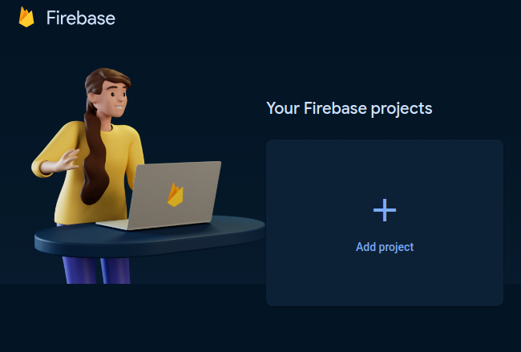
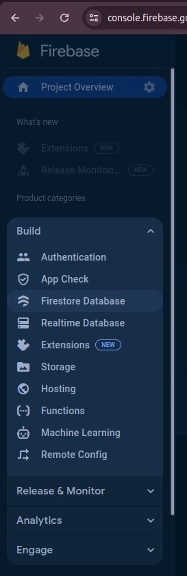
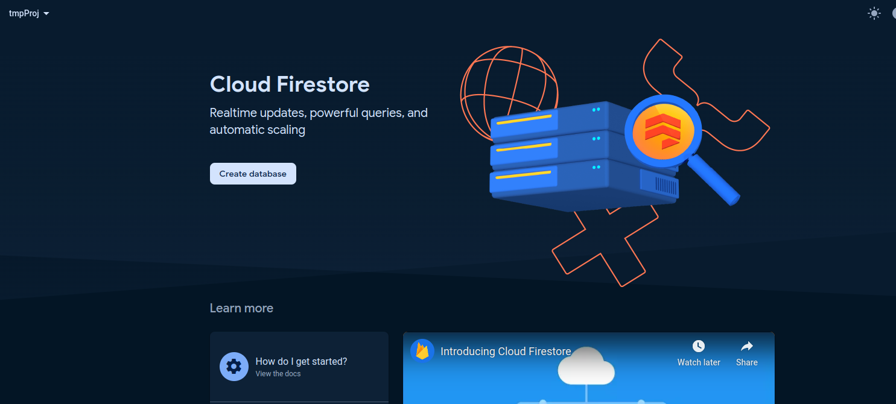
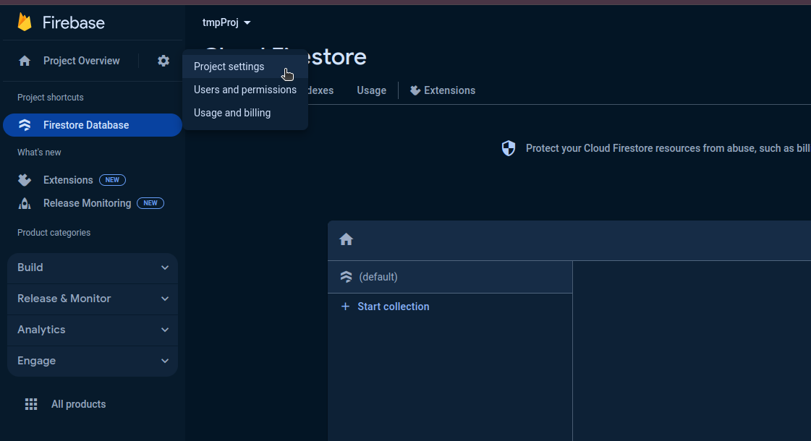
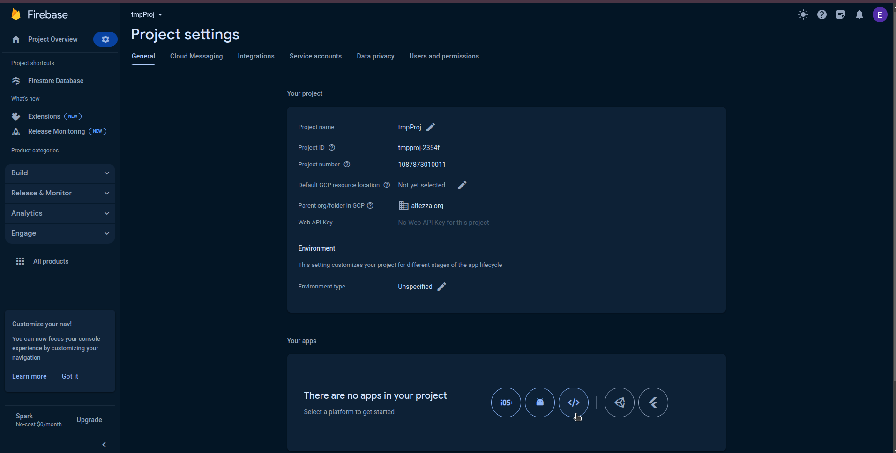
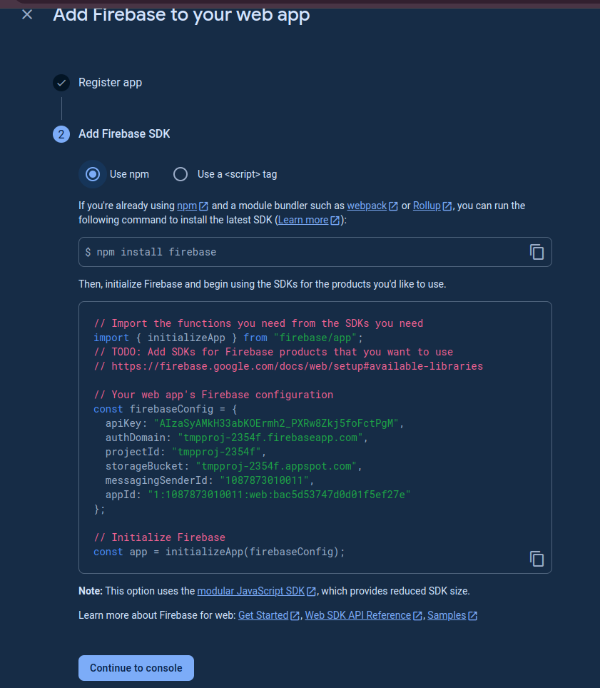
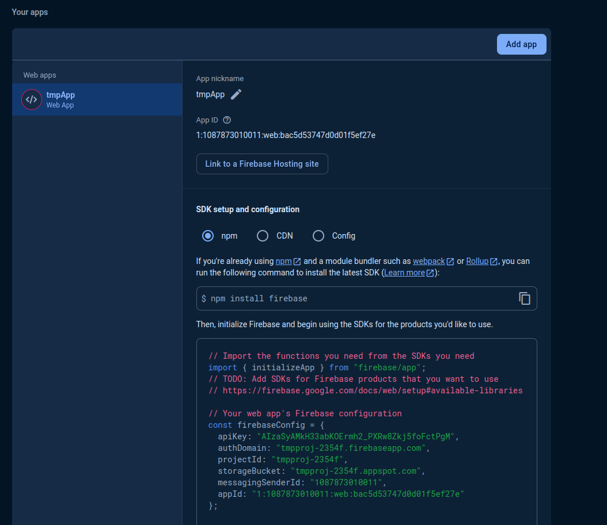
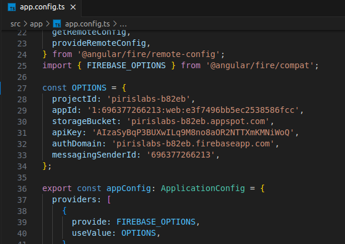

# Lab1

This project was generated with [Angular CLI](https://github.com/angular/angular-cli) version 17.0.10.

## Development server

Run `ng serve` for a dev server. Navigate to `http://localhost:4200/`. The application will automatically reload if you change any of the source files.

## Code scaffolding

Run `ng generate component component-name` to generate a new component. You can also use `ng generate directive|pipe|service|class|guard|interface|enum|module`.

## Build

Run `ng build` to build the project. The build artifacts will be stored in the `dist/` directory.

## Running unit tests

Run `ng test` to execute the unit tests via [Karma](https://karma-runner.github.io).

## Running end-to-end tests

Run `ng e2e` to execute the end-to-end tests via a platform of your choice. To use this command, you need to first add a package that implements end-to-end testing capabilities.

## Further help

To get more help on the Angular CLI use `ng help` or go check out the [Angular CLI Overview and Command Reference](https://angular.io/cli) page.

## Как запускать поделку(руководство для чайников)

1. Для начала клоним проект (git clone)
2. Переходим в директорию с проектом и грузим все зависимости  (npm install) 
3. Заходим на сайт google firebase (https://console.firebase.google.com/u/0/)
4. Создаём новый проект
 

5. После создания проекта в боковой панели на вкладке build выбираем firestoreDatabase 

6. На открывшейся странице жмём на кнопку create database 

7. Выбираем любой DatabaseID и Location. Если хотите с кем-то шарить БД, выбирайте test mode, если только для себя, выбирайте production mode.
8. После создания базы данных в открывшейся странице кликаем по вкладке projectSettings в верхнем левом углу экрана 

 

9. На отрывшейся странице кликаем по значку 'add web app' 

;

10. Задаём имя приложения(любое, какое хочешь) и жмём кнопку register app.
11. Во открывшемся втором этапе('add firebase SDK') видим необходимые креды 

12. Копируем содержимое объекта firebaseConfig и нажимаем на кнопку continue to console.
13. В отрывшейся странице должно показаться добавленное приложение 

.

14. Переходим в файл проекта ./src/app/app.config.ts и вставляем в объект OPTIONS скопированное содержимое объекта firebaseConfig из пункта 12 

15.Запускаем приложение из консоли при помощи команды ng serve или npm run start. Открываем localhost:4200 в любом браузере. Наблюдаем работающее приложение.
